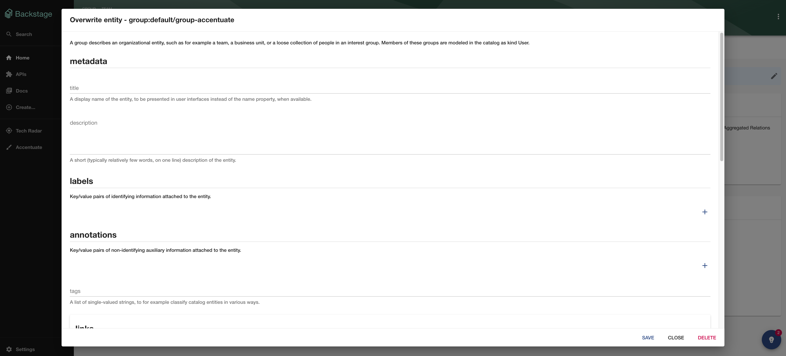
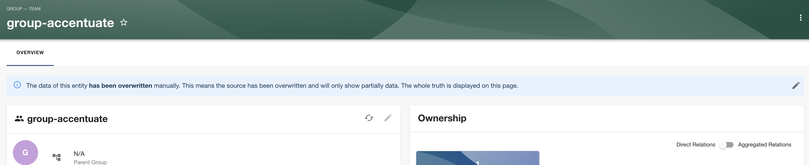
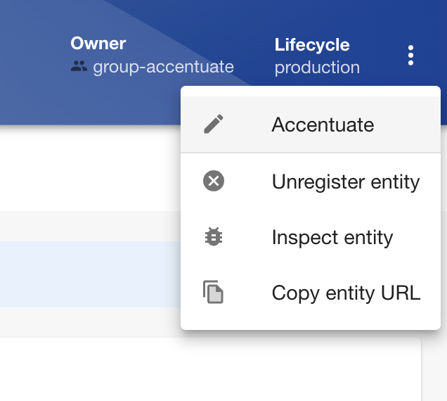
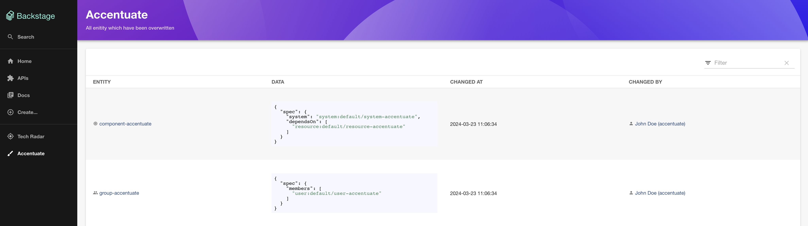

# Accentuate Plugin

Welcome to the accentuate plugin.

This plugin provides the ability to overwrite entities in the UI without change the backing YAML definition from SCM.

Provided are the following functionalities:

- Component to show that an entity has been overwritten
- Component to edit entities based on JSON schemas
- Page to get an overview what has been overwritten
- Backend storing additional data in the database and responsible for merging

Future ideas:

- Provide ability to create entities
- Integrate in inspect dialog



## Setup

Install this plugin:

```bash
# From your Backstage root directory
yarn --cwd packages/app add @dweber019/backstage-plugin-accentuate
```

### Configuration

You need to have the [accentuate backend plugin](../accentuate-backend/README.md) configured.

#### Allowed kinds

You can configure which entity kind (e.g. Group) are modifiable by the plugin by using

```yaml
accentuate:
  allowedKinds:
    - kind: 'User'
    - kind: 'Group'
    - kind: 'Group'
    - kind: 'Component'
    - kind: 'Resource'
    - kind: 'System'
    - kind: 'Domain'
```

The list above is the default.

You can even more specific control the allowed entities over the `spec.type` with

```yaml
accentuate:
  allowedKinds:
    - kind: 'Component'
      specType: 'service'
```

This could mean only components of type service are allowed to be accentuated.

#### Annotations

You can use the following annotation to disable modification on a per-entity level

```yaml
apiVersion: backstage.io/v1alpha1
kind: Component
metadata:
  name: component-accentuate
  annotations:
    accentuate/disable: 'true'
spec: ...
```

### Entity Pages

You have two options to show and edit an entity.

#### Info banner



For this implement the `EntityAccentuateInfo` like

```tsx
// packages/app/src/components/catalog/EntityPage.tsx

import {
  EntityAccentuateInfo,
  isAccentuateEnabled,
} from '@dweber019/backstage-plugin-accentuate';

const entityWarningContent = (
  <>
    ...
    <EntitySwitch>
      <EntitySwitch.Case if={isAccentuateEnabled}>
        <Grid item xs={12}>
          <EntityAccentuateInfo />
        </Grid>
      </EntitySwitch.Case>
    </EntitySwitch>
  </>
);
```

#### Context menu



For this implement the `EntityAccentuateInfo` like

```tsx
// packages/app/src/components/catalog/EntityPage.tsx

import { EntityLayoutWrapper } from '@dweber019/backstage-plugin-accentuate';

const serviceEntityPage = (
  <EntityLayoutWrapper>
    <EntityLayout.Route path="/" title="Overview">
      {overviewContent}
    </EntityLayout.Route>
    ...
  </EntityLayoutWrapper>
);
```

> If you are other plugins using context menu, you most probably have to reimplement this you own.

### Overview page



To add the overview page you have to add the page at

```tsx
// packages/app/src/App.tsx

import { AccentuatePage } from '@dweber019/backstage-plugin-accentuate';

const routes = (
  <FlatRoutes>
    ...
    <Route path="/accentuate" element={<AccentuatePage />} />
  </FlatRoutes>
);
```

Then extend the navigation like

```tsx
// packages/app/src/components/Root/Root.tsx

import BrushIcon from '@material-ui/icons/Brush';

export const Root = ({ children }: PropsWithChildren<{}>) => (
  <SidebarPage>
    <Sidebar>
      <SidebarGroup label="Menu" icon={<MenuIcon />}>
        <SidebarScrollWrapper>
          ...
          <SidebarItem icon={BrushIcon} to="accentuate" text="Accentuate" />
        </SidebarScrollWrapper>
      </SidebarGroup>
    </Sidebar>
    {children}
  </SidebarPage>
);
```

## Icon

Thanks to [Dust icons created by Konkapp - Flaticon](https://www.flaticon.com/free-icons/dust) for the icon.
