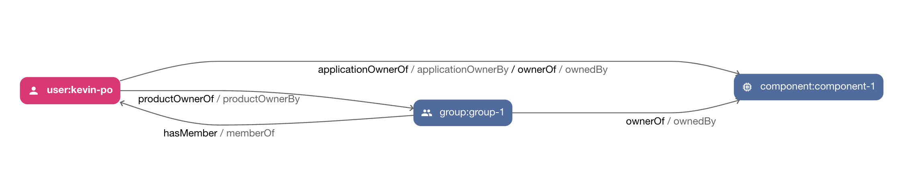
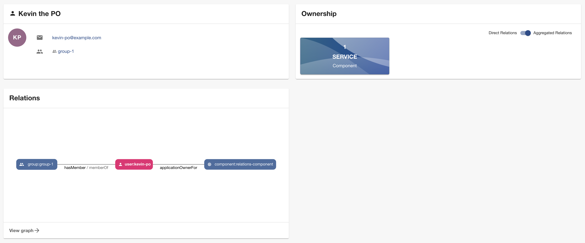

# Relations processor

This relations processor plugin emits additional custom relations, which are shown in the
[Catalog Graph](https://github.com/backstage/backstage/blob/master/plugins/catalog-graph/README.md) out of box.

Additionally, you can install the [Relations frontend plugin](../relations/README.md) for a better frontend experience with this processor.



## Install

### Setup plugin

First we need to add the `@dweber019/backstage-plugin-relations-backend` package:

```sh
# From your Backstage root directory
yarn add --cwd packages/backend @dweber019/backstage-plugin-relations-backend
```

Then we open the file named `packages/backend/src/plugins/catalog.ts`, and extend it with:

```ts
import { RelationsEntitiesProcessor } from '@dweber019/backstage-plugin-relations-backend';

export default async function createPlugin(
  env: PluginEnvironment,
): Promise<Router> {
  const builder = await CatalogBuilder.create(env);

  builder.addProcessor(RelationEntitiesProcessor.fromConfig(env));

  const { processingEngine, router } = await builder.build();
  // ..
}
```

## Configuration

See the `config.d.ts` file for a documentation of the configuration.

Here is a simple configuration, which will add an attribute named `supporter`, which allows relations to `User` and `Group` on a `Resource`.
Additionally, we can use the attribute `applicationOwner` on `Component` to allow relations to a `User`.

```yaml
relationsProcessor:
  relations:
    - sourceKind: component
      targetKinds:
        - user
      attribute: applicationOwner
      pairs:
        - incoming: applicationOwnerOf
          outgoing: applicationOwnerBy
    - sourceKind: resource
      targetKinds:
        - user
        - group
      attribute: supporter
      multi: true
      pairs:
        - incoming: supporterOf
          outgoing: supportedBy
```

## Usage

The above definitions would allow to define the following entities

```yaml
apiVersion: backstage.io/v1alpha1
kind: Resource
metadata:
  name: resource-1
spec:
  type: db
  owner: group:default/group-1
  supporter:
    - john-doe
    - group:default/group-1
---
apiVersion: backstage.io/v1alpha1
kind: Component
metadata:
  name: component-1
spec:
  type: service
  lifecycle: production
  owner: group:default/group-1
  applicationOwner: user:default/kevin-po
```

### Catalog graph

It's recommend to use the [Relations frontend plugin](../relations/README.md) to add new relations to the filters and set good defaults.

### Using well known relations

You can use the [Well-known Relations between Catalog Entities](https://backstage.io/docs/features/software-catalog/well-known-relations#ownedby-and-ownerof)
relations with this plugin. This is useful if a component is owned by a group and has an application owner, which should have an ownership too.

```yaml
apiVersion: backstage.io/v1alpha1
kind: Component
metadata:
  name: component-1
spec:
  type: service
  lifecycle: production
  owner: group:default/group-1
  applicationOwner: user:default/kevin-po
```

To enable the owner relation use the following configuration.

```yaml
relationsProcessor:
  relations:
    - sourceKind: component
      targetKinds:
        - user
      attribute: applicationOwner
      pairs:
        - incoming: applicationOwnerOf
          outgoing: applicationOwnerBy
        - incoming: ownerOf
          outgoing: ownerBy
```



### New Backend System

The backend plugin has support for the [new backend system](https://backstage.io/docs/backend-system/), here's how you can set that up:

In your `packages/backend/src/index.ts` make the following changes:

```ts
const backend = createBackend();

backend.add(import('@dweber019/backstage-plugin-relations-backend'));

// ... other feature additions

backend.start();
```

> This was not tested and is here for reference

## Icon

Thanks for the icon [Machine-learning icons created by Becris - Flaticon](https://www.flaticon.com/free-icons/machine-learning)
