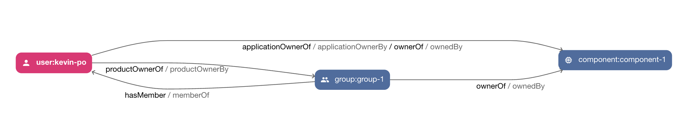
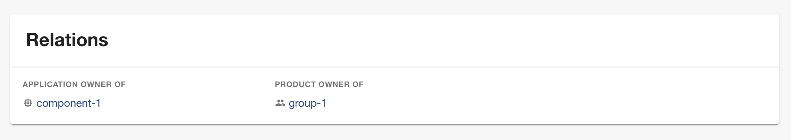

# Relations Plugin

Welcome to the relations plugin.

This plugin improves the experience when using the [relations processor plugin](../relations-backend/README.md) by:

- Providing a custom component for visualizing relations
- Provide [catalog graph](https://github.com/backstage/backstage/blob/master/plugins/catalog-graph/README.md) wrappers for
  - Better defaults
  - Add new relations to filter als options




## Setup

Install this plugin:

```bash
# From your Backstage root directory
yarn --cwd packages/app add @dweber019/backstage-plugin-relations
```

### Configuration

You need to have the [relations processor plugin](../relations-backend/README.md) configured.

Additionally, make sure to use at least Backstage version `1.27.0`.

### Entity Pages

As you introduced new relations you either have to manually add the relation to the `EntityCatalogGraphCard` or the replacement
`EntityRelationsCatalogGraphCard`. This new card will add all newly configured relation pairs and enable arrows as default.

```tsx
// packages/app/src/components/catalog/EntityPage.tsx

import { EntityRelationsCatalogGraphCard } from '@dweber019/backstage-plugin-relations';

const groupPage = (
  <EntityLayout>
    <EntityLayout.Route path="/" title="Overview">
      <Grid container spacing={3}>
        {entityWarningContent}
        ...
        <Grid item md={6} xs={12}>
          <EntityRelationsCatalogGraphCard variant="gridItem" height={400} />
        </Grid>
        ...
      </Grid>
    </EntityLayout.Route>
  </EntityLayout>
);
```

Additionally, there is a custom card called `EntityRelationsCard` to show additional relations.

```tsx
const userPage = (
  <EntityLayout>
    <EntityLayout.Route path="/" title="Overview">
      <Grid container spacing={3}>
        {entityWarningContent}
        ...
        <Grid item md={6} xs={12}>
          <EntityRelationsCard relations={relationLabels} />
        </Grid>
      </Grid>
    </EntityLayout.Route>
  </EntityLayout>
);
```

You can define a list of relations incl. labels to show like above with `relationLabels`, which look like

```ts
export const relationLabels = [
  {
    name: 'applicationOwnerOf',
    label: 'Application owner of',
  },
  {
    name: 'applicationOwnerBy',
    label: 'Application owner',
  },
];
```

If you don't define this, only the custom relations (e.g. no owner) will be displayed.

### Root catalog graph

The catalog graph at `/catalog-graph` can be changed to by using the `RelationsCatalogGraphPage` like

```tsx
// packages/app/src/App.tsx

import { RelationsCatalogGraphPage } from '@dweber019/backstage-plugin-relations';

const routes = (
  <FlatRoutes>
    ...
    <Route path="/catalog-graph" element={<RelationsCatalogGraphPage />} />
  </FlatRoutes>
);
```
